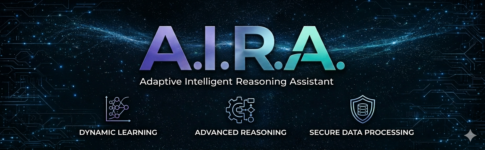

# Open AIRA

Open-source Adaptive Intelligent Reasoning Assistant for guided debugging, direct fixes, and progress tracking.

## What It Is

Open AIRA is a browser-first debugging workspace built to help people think through bugs instead of jumping straight to the final answer.

It currently supports two main workflows:

- `Debug` mode: guided coaching with thoughts, hints, progress tracking, and stats
- `Fix` mode: corrected code plus a separate change log

## Core Highlights

- Guided debugging flow with `Send`, `Next Hint`, and `I Did It`
- Direct fix mode with syntax-highlighted corrected code
- Separate change-log output in fix mode
- Normal stats plus advanced learning stats
- Multi-provider API support: Gemini, OpenAI, Grok, Claude, and DeepSeek
- Optional shared demo mode for quick testing
- Separate `/admin` dashboard for key and session control
- `/help`, `clear`, and `clr` commands
- Dark and light theme support

## Open-Source Note

Open AIRA is intended to be maintained as an open-source project.

That means:

- the frontend source is visible to browser users
- secrets should never be committed to the repo
- demo keys, admin secrets, and deployment credentials should be provided through environment variables

## Privacy Model

Open AIRA uses a browser-session API flow:

- users can enter their own API key
- the key is stored only in that browser session
- the key is not stored permanently by the backend
- users can remove the key at any time

The optional shared demo mode should be treated as testing-only.

## Tech Stack

- HTML
- CSS
- JavaScript
- Python
- Flask
- Flask-CORS
- Requests
- Gemini API
- OpenAI-compatible APIs
- Anthropic API

## Project Structure

```text
Open-AIRA/
|-- assets/
|   |-- Change log/
|   `-- Logo/
|-- backend/
|   |-- admin_routes.py
|   |-- key_manager.py
|   `-- server.py
|-- docs/
|   `-- (GitHub Pages copy of frontend)
|-- frontend/
|   |-- admin/
|   |-- assets/
|   |-- app.js
|   |-- config.js
|   |-- index.html
|   |-- style.css
|   `-- vercel.json
|-- key/
|-- LICENSE
|-- Procfile
|-- railway.json
|-- render.yaml
|-- requirements.txt
`-- README.md
```

## Local Setup

### 1. Install dependencies

From the repo root:

```powershell
pip install -r requirements.txt
```

### 2. Run the backend

```powershell
cd backend
python server.py
```

Backend default:

```text
http://127.0.0.1:5000
```

### 3. Run the frontend

Open a second terminal:

```powershell
cd frontend
python -m http.server 5500
```

Frontend default:

```text
http://127.0.0.1:5500
```

## How To Use

1. Open the frontend URL
2. Choose a provider and submit your own API key, or try the demo
3. Select `Debug` or `Fix`
4. Paste code into `Input Code`
5. Use `Run`

## Debug Mode Flow

1. Paste broken code
2. Click `Run`
3. Open AIRA asks where you think the problem is
4. Use `Send` to submit your guess
5. Use `Next Hint` when needed
6. Finish with `I Did It` or by submitting the correct fix

## Fix Mode Flow

1. Switch to `Fix`
2. Paste code
3. Click `Run`
4. Read the corrected code in the fixed-code card
5. Read the AI change summary in the change-log card

## Commands

- `/help`
- `clear`
- `clr`

## Environment Variables

Recommended backend environment variables:

- `OPEN_AIRA_SESSION_SECRET`
- `OPEN_AIRA_DEMO_API_KEY`
- `OPEN_AIRA_ADMIN_USERNAME`
- `OPEN_AIRA_ADMIN_PASSWORD_HASH`

Backward-compatible `CODESENTINEL_*` names still work, but new deployments should use the `OPEN_AIRA_*` names.

## Deployment

### Backend

Render and Railway config files are already included:

- [render.yaml](./render.yaml)
- [railway.json](./railway.json)
- [Procfile](./Procfile)

### Frontend

Frontend deploy target:

- set Vercel Root Directory to `frontend`

### GitHub Pages

GitHub Pages can publish the static frontend from:

- `main` branch
- `/docs` folder

The `docs` directory is a publishable copy of `frontend`, so GitHub Pages can serve Open AIRA without exposing the backend files as the site root.

API config lives in:

- [frontend/config.js](./frontend/config.js)

## Current Limitations

- the backend still sees the active API key in each request because it must forward prompts to the selected provider
- frontend code is public to browser users even when the repo stays private
- fix quality depends on the selected provider response quality
- the shared demo connection can be slower, less private, or quota-limited

## License

This project is licensed under the MIT License. See [LICENSE](./LICENSE).

## Author

Built by 100RAV.
